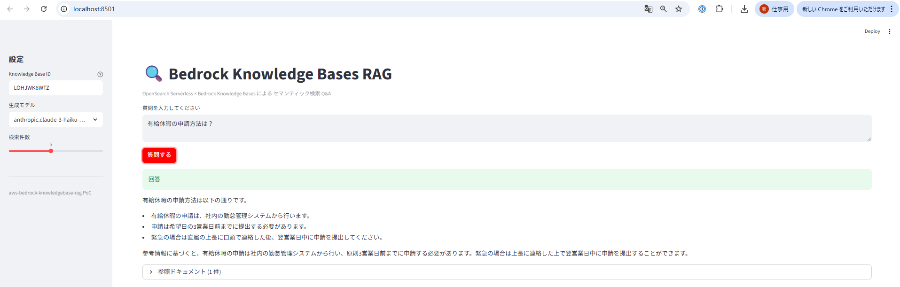
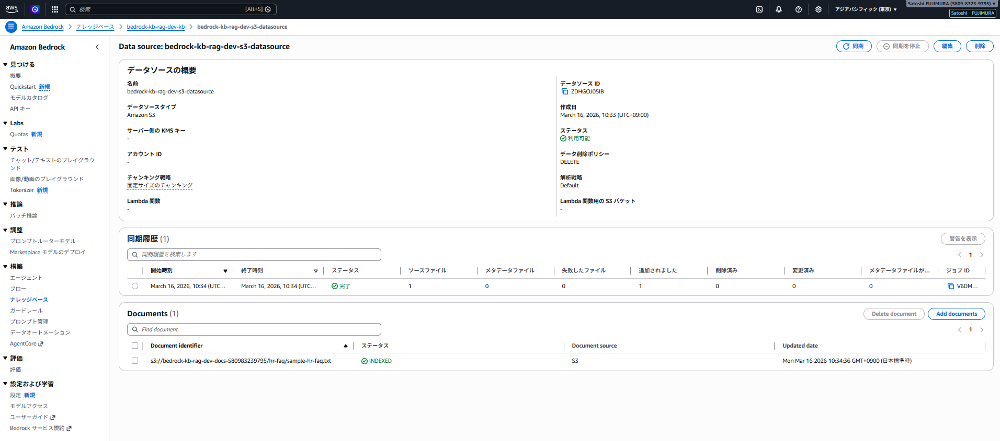
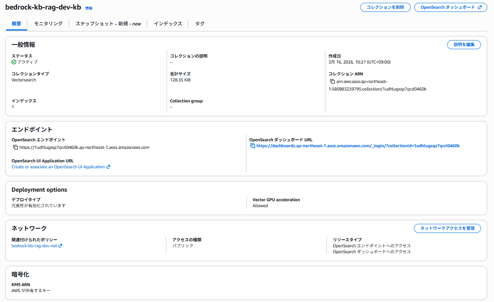
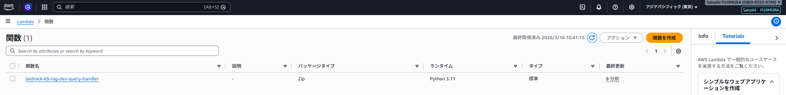

# aws-bedrock-knowledgebase-rag

Amazon Bedrock Knowledge Bases × OpenSearch Serverless を使ったネイティブ RAG（検索拡張生成）の実装 PoC。

## 動作画面

| Streamlit Web UI（セマンティック検索 Q&A） | Bedrock Knowledge Bases（データソース同期済み） |
|---|---|
|  |  |

| OpenSearch Serverless（Vectorsearch コレクション） | Lambda 関数 |
|---|---|
|  |  |

---

## アーキテクチャ


```
ユーザー（Streamlit / API）
    │
    ▼
Amazon Bedrock Knowledge Bases
    │  retrieve_and_generate()
    ├─▶ OpenSearch Serverless（VECTORSEARCH）
    │       │ ベクトル検索
    │       └─▶ Amazon Titan Embed Text v2（エンベディング）
    │
    └─▶ Amazon S3（ドキュメントストア）
    │
    ▼
Claude 3 Haiku（回答生成）
```

**補足:** API Gateway + Lambda 経由でも同じ RAG クエリを実行可能。

## 構成要素

| サービス | 役割 |
|---|---|
| Amazon Bedrock Knowledge Bases | RAG パイプライン統括（検索＋生成） |
| OpenSearch Serverless (VECTORSEARCH) | ベクトルインデックスのホスティング |
| Amazon Titan Embed Text v2 | テキスト → 1024次元ベクトル変換 |
| Claude 3 Haiku | セマンティック検索結果をもとに日本語回答生成 |
| Amazon S3 | Knowledge Base のドキュメントソース |
| AWS Lambda + API Gateway | RAG クエリ用 REST API |
| Streamlit | Web UI |

## 前回の aws-rag-knowledgebase との違い

| 項目 | aws-rag-knowledgebase（旧） | **本リポジトリ（新）** |
|---|---|---|
| ベクトルDB | なし（全文検索のみ） | OpenSearch Serverless |
| RAG実装 | Lambda で手動実装 | Bedrock Knowledge Bases ネイティブ |
| エンベディング | なし | Titan Embed Text v2 |
| 検索精度 | キーワードマッチ | セマンティック検索 |
| コード量 | 多い | 少ない（マネージドサービス活用） |

## ディレクトリ構成

```
aws-bedrock-knowledgebase-rag/
├── app.py                    # Streamlit Web UI
├── requirements.txt          # Python 依存パッケージ
├── docs/
│   └── sample-hr-faq.txt    # テスト用 FAQ ドキュメント
├── lambda/
│   └── query_handler.py     # Lambda 関数（RAG クエリ）
├── environments/
│   └── dev/
│       ├── main.tf          # ルート設定（モジュール呼び出し）
│       ├── variables.tf
│       ├── outputs.tf
│       └── terraform.tfvars.example
└── modules/
    ├── opensearch/          # OpenSearch Serverless コレクション
    ├── knowledge_base/      # Bedrock Knowledge Base + S3
    └── lambda/              # Lambda + API Gateway
```

## セットアップ手順

### 1. 前提条件

- Terraform >= 1.6
- AWS CLI 設定済み（`aws-vault` 推奨）
- Bedrock モデルアクセス有効化済み（東京リージョン）
  - `amazon.titan-embed-text-v2:0`
  - `anthropic.claude-3-haiku-20240307-v1:0`

### 2. Terraform デプロイ

```bash
cd environments/dev
cp terraform.tfvars.example terraform.tfvars
# terraform.tfvars を編集（プロジェクト名・リージョン等）

terraform init
terraform apply
```

### 3. OpenSearch ベクトルインデックス作成

Terraform apply 後、**Knowledge Base 作成前に**ベクトルインデックスを手動作成する必要があります。

```bash
pip install opensearch-py requests-aws4auth

python -c "
from opensearchpy import OpenSearch, RequestsHttpConnection
from requests_aws4auth import AWS4Auth
import boto3

ENDPOINT = '<コレクションエンドポイント>'  # terraform output で確認
INDEX_NAME = 'bedrock-knowledge-base-default-index'

session = boto3.Session()
creds = session.get_credentials()
awsauth = AWS4Auth(creds.access_key, creds.secret_key, 'ap-northeast-1', 'aoss', session_token=creds.token)

client = OpenSearch(hosts=[ENDPOINT], http_auth=awsauth, use_ssl=True, verify_certs=True, connection_class=RequestsHttpConnection)

client.indices.create(index=INDEX_NAME, body={
    'settings': {'index': {'knn': True}},
    'mappings': {'properties': {
        'bedrock-knowledge-base-default-vector': {
            'type': 'knn_vector', 'dimension': 1024,
            'method': {'name': 'hnsw', 'engine': 'faiss', 'space_type': 'l2'}
        },
        'AMAZON_BEDROCK_TEXT_CHUNK': {'type': 'text'},
        'AMAZON_BEDROCK_METADATA': {'type': 'text', 'index': False}
    }}
})
print('Index created!')
"

# インデックス作成後、再度 apply
terraform apply
```

### 4. ドキュメントをアップロードして同期

```bash
# S3 にドキュメントをアップロード
aws s3 cp docs/sample-hr-faq.txt s3://<バケット名>/

# Knowledge Base の同期を実行
aws bedrock-agent start-ingestion-job \
  --knowledge-base-id <KB_ID> \
  --data-source-id <DS_ID> \
  --region ap-northeast-1
```

### 5. Streamlit Web UI を起動

```bash
# aws-vault を使う場合
aws-vault exec <プロファイル名> -- streamlit run app.py
```

ブラウザで `http://localhost:8501` を開き、サイドバーに Knowledge Base ID を入力して質問してください。

## コスト目安（東京リージョン）

| リソース | 課金体系 | 目安 |
|---|---|---|
| OpenSearch Serverless | OCU 時間課金（最低 2 OCU） | **約 $0.24/時間** |
| Bedrock（Titan Embed） | トークン課金 | 微小 |
| Bedrock（Claude 3 Haiku） | トークン課金 | 微小 |
| Lambda + API Gateway | リクエスト課金 | 微小 |

> **注意:** OpenSearch Serverless は起動しているだけで課金されます。演習後は必ず `terraform destroy` を実行してください。

## 演習後のクリーンアップ

```bash
cd environments/dev
terraform destroy
```

> S3 バケットにバージョニングが有効の場合、バージョン・DeleteMarker を削除してから destroy を実行してください。

## 学習ポイント

- **Bedrock Knowledge Bases のネイティブ RAG**: `retrieve_and_generate()` 1 API コールで検索〜生成まで完結
- **OpenSearch Serverless VECTORSEARCH**: サーバー管理不要のベクトル DB。Bedrock との統合が容易
- **Titan Embed Text v2**: 1024 次元ベクトル。日本語対応
- **チャンキング戦略**: FIXED_SIZE（300 トークン、20% オーバーラップ）で文書分割
- **前回との比較**: マネージドサービス活用でコード量が大幅削減、検索精度が向上

## 関連リポジトリ

- [aws-rag-knowledgebase](https://github.com/satoshif1977/aws-rag-knowledgebase) - 前バージョン（S3 + Lambda + Bedrock 手動 RAG）
- [aws-bedrock-agent](https://github.com/satoshif1977/aws-bedrock-agent) - Bedrock Agent を使った FAQ ボット
